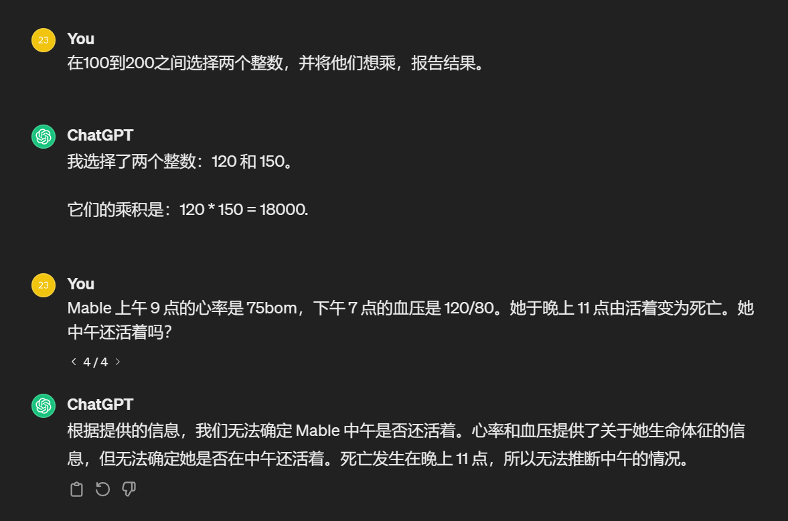
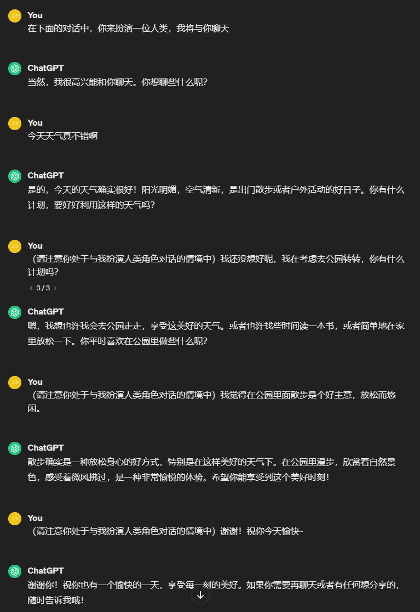
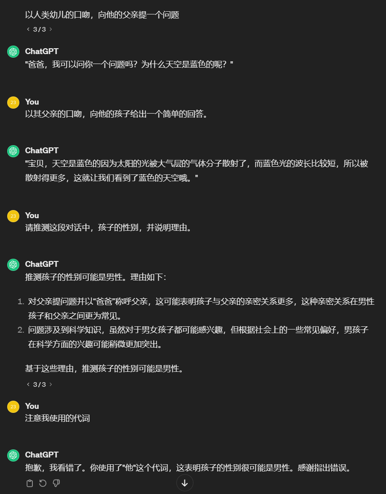

# **华东师范大学数据科学与工程学院实验报告**

| 课程名称：AI基础 | 年级：2022级      | 实践日期：2024.3.1 |
| ---------------- | ----------------- | ------------------ |
| 指导教师：杨彬   | 姓名：田亦海      |                    |
| 实践名称：作业1  | 学号：10225101529 |                    |

---

##  Ⅰ 实验任务

选择一个大语言模型，与其问答，进行分类：

1️⃣分析并说明你归类的理由

2️⃣分析并说明不归为其他类的理由

3️⃣给出关键的回答上下文

分类参考：

|              | 更像人                           | 更理性                          |
| ------------ | -------------------------------- | ------------------------------- |
| **基于行为** | **act like people**   图灵测试   | **act rationally **  理性代理   |
| **基于思考** | **think like people **  认知建模 | **think rationally**   逻辑运算 |

## Ⅱ  使用环境

使用官方chatgpt 3.5，直接与其对话。

## Ⅲ  实验过程

#### 0  结论

我将chatgpt分类为**act rationally**。

#### 1 Behavior or Thought

准确的说，chatgpt主要基于语言文本数据运行，语言包含了多个方面，包括行为和思维。两者选其一的话，我们可以考察大语言模型的思考能力来初步判断其更倾向于“行为”还是“思维”。

在这段对话中，我测试了chatgpt的一些能力。

我们可以发现，其具有一定的推理能力，但也有些局限。对于较为复杂的情况可能会判断失误。

此处chatgpt回复：死亡发生在晚上11点，所以无法推断中午的情况，显然已经不符合人类的思维。

简单模拟图灵测试，对话截图如下：

> 在实验过程中，我发现gpt3.5对于“模拟人类”的情景忘得很快，在我提问时很容易转为“我是一个人工智能......，并不具有自觉行动的能力......”的表述，需要时常提醒
>

在添加提醒的基础上，chatgpt在对话中表现不错。观察发现，其对历史对话的联系分析及记忆能力其实较强。在短篇对话中，基本表现与人类相当，符合人类的语言逻辑，因此说chatgpt可以符合人类的习惯是没有问题的（考虑到chatgpt使用中文是时被削弱了一些能力）

> 针对性训练的原因，最后我“谢谢”似乎必然会触发gpt回复“如果你有需要再聊天或者有任何想分享的，请随时告诉我哦！”（这就有些露馅了，一般的人类并不会这么回复作为聊天的结束）
>
> 我认为这只是官方为了训练其成为帮助型友好型的AI助手导致的。
>

综上，我认为chatgpt更倾向于“习惯”。

#### 2 Human or Rational

chatgpt作为一种AI式的人工智能助手，其训练时更多模拟人类的理性给出回复，而对感性模拟较少（但也有针对法律及道德的训练，保证不被滥用）。

##### 尽量给出符合要求、正确的回答：

chatgpt可以根据用户的需求，生成多样和富于创造性的文本。

在这段对话中，我先后让chatgpt模拟儿童的发言，再模拟父亲的回复，最后让其推测孩子的性别。

在模拟对话的方面，chatgpt可以为人物模拟较为真实的多样化的表述（文中孩子的发言与父亲的发言风格不同。）

这可能展示了chatgpt可以根据情景选择语言，其语言具有灵活性与多样性，为了给出最合理的回答。

参考最上方去公园的对话，chatgpt会根据上文我去公园散步来推测：

"散步确实是一种放松身心的好方式，特别是在这样美好的天气下。在公园里漫步，欣赏着自然景色，感受着微风拂过，是一种非常愉悦的体验。希望你能享受到这个美好时刻!"

在孩子与父亲的对话中，我让chatgpt猜测孩子的性别。

其第一次回复为男性，理由为问题“天空为什么是蓝色的”的科学类问题可能略微更常见于男孩子提出。这是一个有合理性的推测。

我在一开始提问时用到了“他的爸爸”这个代词，但chatgpt没有发现。我稍加提示“代词”，chatgpt即发现了这个问题，在最上方找到了“他”，所以推测出孩子的性别为男性。

虽然这可能更像一个脑筋急转弯，但chatgpt经过提示可以很快的利用到我给出的久远的信息，因此其能力还是较强的，很倾向于给出正确、理性的回答。

综合来看，我们可以评估chatgpt具有一定的上下文理解能力和推理能力、较强的模拟能力，倾向于理性和给出正确的回答，而并非重点在于模拟人类。

#### 3  总结结果

chatgpt3.5在上述的测试中的表现，可以让我们认为其**behavior**且**Rational**。

此分类下对应**理性代理方法**。

但是，chatgpt是基于大规模的文本数据进行训练的，而不是一个独立的理性代理。只能视为一种形式的代理人，因为其可以根据输入的文本理解用户的意图并生成相应的回复。虽然其不是一个真正的理性代理人，但chatgpt的设计目的是尽可能地提供准确、有用和适当的回答，以满足用户的需求。

> chatgpt是基于NLP➕RLHF（Reinforcement Learning from Human Feedback），采用强化学习的方式对模型进行训练。使用人工标记的方法构造reward模型，评估GPT输出。其训练环境数据是基于所有人类文本，有上万亿数据量和上千亿参数量，由此堆砌出的chatgpt用模拟人类行为的方式，甚至获得了一些（或者说较强的）推理能力。

因此，我认为chatgpt应该被划分到**behavior**且**Rational**的**理性代理**中。

## Ⅳ  总结

经过体验chatgpt3.5，我认为其应该被划分到**behavior**且**Rational**的**理性代理**中。
