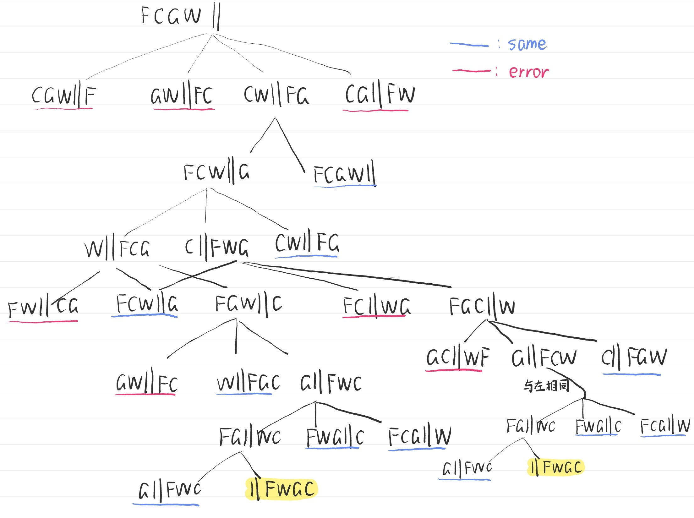
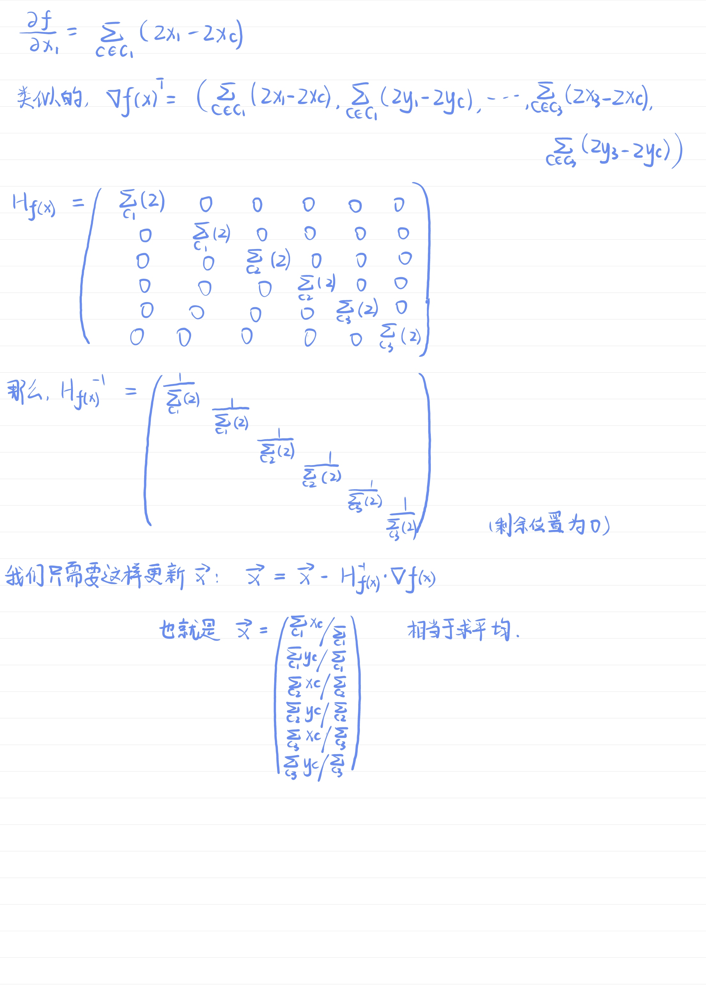

# **华东师范大学数据科学与工程学院实验报告**

| 课程名称：AI基础                  | 年级：2022级 | 实践日期：2024.3.8 |
| --------------------------------- | ------------ | ------------------ |
| 指导教师：杨彬                    | 姓名：limboy |                    |
| 实践名称：Problem Solving: Search | 学号：529    |                    |

---

##  Ⅰ 实验任务

练习常见的搜索算法

## Ⅱ  使用环境

使用clion编译调试 线上oj评测

## Ⅲ  实验过程

#### 0 附加内容

##### 农夫过河问题，状态转移图

##### 黑塞矩阵

## Ⅳ  总结

