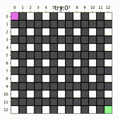

# **华东师范大学数据科学与工程学院实验报告**

| 课程名称：AI基础                  | 年级：2022级 | 实践日期：2024.3.8 |
| --------------------------------- | ------------ | ------------------ |
| 指导教师：杨彬                    | 姓名：limboy |                    |
| 实践名称：Problem Solving: Search | 学号：529    |                    |

---

(查看.md获得最佳效果)

##  Ⅰ 实验任务

练习常见的搜索算法

## Ⅱ  使用环境

使用c++17(clion), python 3.11.5(vscode)

线下pre, 线上oj评测

## Ⅲ  实验过程

#### 0 附加题

##### 农夫过河问题，状态转移图

##### 黑塞矩阵

#### Prob1 热身

##### bfs  

(可达性)使用队列实现，当前新访问到的点添加到队尾。

每次从队头取出一个点，尝试往其他方向更新从未访问过的点，加进队尾

直到访问至目标点。

假设V点E边，使用邻接表，时间复杂度$$O(|V|+|E|)$$,空间复杂度$$O(|V|+|E|)$$

##### 基础Dijkstra 

(单源最短路)使用一个数组维护当前所有可以访问的点的距离，

每次"固定"其中最近的点，以此更新相邻的点的距离

邻接表，时间$$O(|V|^2+|E|)$$，空间$$O(|V|+|E|)$$

##### **堆优化Dijkstra**   

使用一个优先队列存储所有可以访问到的点，

每次从队头取出最近点，固定，并以此更新相邻的点的距离，再插入优先队列

邻接表，时间$$O(\space\space(|V|+|E|)log(|E|)\space\space)$$，空间$$O(|V|+|E|)$$

#### Prob2 八数码

##### DFS判断可解

时间复杂度$$O(9!/2*log(9!/2)) \approx 1e6$$

(复杂度来源于set判重)

即遍历所有情况

##### BFS最短路

由于所有操作的花费均为1，所以第一次达到目标即为最短路

时间复杂度$$\approx 1e6$$

不过，如果使用康托展开作为哈希函数，来判重，则可以去掉set的一个log的复杂度，优化后大概是$$1e5$$

##### Dijkstra最短路

由于所有操作的花费均为1，所以与bfs路径完全相同

时间复杂度$$\approx 1e6$$

（来源于set和优先队列）

##### A*最短路

使用曼哈顿距离为启发函数很合适

实际运行时时间复杂度 小于 dij，与启发函数的优劣相关，最坏会退化为迪杰斯特拉。 

如果启发函数的估计大于实际路径长度，则可能找不到最短路。

#### Prob3 迷宫及可视化

##### 项目框架

其中，*3_x.py*是四种算法的代码，bfs，dfs，Dijkstra，astar

*generate.py*是一个使用简单prim算法根据参数生成迷宫的代码

*puzzle.py* 仅用于放置较为典型的迷宫（毕竟迷宫生成具有随机性）

*tmp.py* 存放临时代码

*visual.py* 是可视化代码，其中包括一些我封装的函数，可以根据传入的参数画图

##### 可视化代码

(可以参看代码中的注释.)

函数**look_look(maze, vis, pre, dis, now,cnt,fontsiz,t,t_end)**

参数分别是迷宫矩阵,访问过的地区,节点的前继,所有点的最短路,当前所处位置,探索次数,字体大小,显示时间,终止时显示时间

首先根据maze使用imshow画图,并标注坐标轴(这里我将x轴调整为上方, 与迷宫序号对应)

然后染色起点和终点

遍历迷宫每个点根据dis和vis对其染色, 并显示距离, 

使得已经确定最短路的道路显示为浅灰色,即将访问的道路为三角形橘色

染色agent当前位置(violet!)

根据前继信息,得出当前点到起点的路经,并绘图

显示尝试次数try,若到达终点则显示finished,根据是否达到终点决定展示时间.最后清空画板

##### 算法代码(astar为例)

import需要的库和代码文件

visual是可视化代码,generate是生成迷宫代码.

main调用astar进入,可以传入迷宫为参数,也可以使用函数生成的迷宫为参数

大致算法流程:

声明cnt用于记录尝试次数,生成plt窗口并非阻塞显示,初始化vis dis pre数组, 声明优先队列 ,其中权值为总估计距离

(使用曼哈顿距离为启发函数) 内容为`[x位置,y位置,当前已用距离,预估剩余距离]`, 

循环遍历优先队列,并向其他方向探索即可.

这里magic参数主要是是否允许打墙,每进入墙面会产生共计5的花费

每次循环最后调用`look_look`画图,并根据是否达到终点return.

效果如图(这是一个gif图,可在md文件中查看)

如果允许穿墙,即使用`magic=True`

##### 迷宫生成

可以生成一张比较简单的迷宫.

算法:

存储所有待检测墙体及方向,

随机取出一个[墙体,方向],如果顺着方向是未使用过的道路则打通墙壁,并标记道路已经使用,将道路附近的墙壁加入墙体库;

如果道路已经使用过,则不做更改.

值得一提的是,同样可以调用look_look来检视生成的过程.

当然,这个只是生成迷宫最简单的算法的一种,对于墙体的利用并不是很完美.

这是调用此函数作为输入的astar

##### 可视化可以看出什么?

① 对比同一个迷宫(可穿墙)下的dij和astar,

我们可以发现dij探索时几乎是扇形扩散的,需要探索94次

而astar是"一条粗直线",仅允许一定程度的发散.try 51次

仅仅使用一个启发式函数,探索次数就变成了dij的一半.

② dfs在有环图中的低效性

bfs dij astar都可以保证第一次访问到终点就是最短路经(不穿墙情况下),无论有无环

但dfs在有环图却无法保证,其计算得到最短路经的唯一方式只能是把所有点都全部探索完毕,且过程中还会多次探索一个点

请看vcr

最终探索次数为142次

花费了bfs的两倍多(下图为bfs)

## Ⅳ  总结

练习了最小化损失函数使用黑塞矩阵的计算,

熟练运用了bfs dfs dij   的  c++和python 编写, 熟练掌握了astar的使用.

掌握了一种迷宫生成算法, 编写可视化代码直观展示了算法效果,并相互比较.

良好的项目结构

